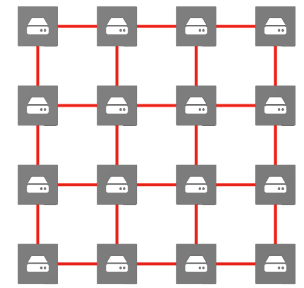

# Distributed Storage System
## Architecture

## Installation and Setup
#### Prerequisites
- Python 3
#### Clone the repository
```bash
git clone https://github.com/shivamwaghela/DistributedStorageSystem.git
```
#### Go to the project directory
```bash
cd DistributedStorageSystem
```
#### Give execute permissions to shell scripts
```bash
chmod 744 install_modules.sh generate_grpc_code.sh
```
#### Install modules and Generate gRPC code
```bash
./install_modules.sh && ./generate_grpc_code.sh
```
#### Start first node
```bash
python3 node/node.py [x_coord] [y_coord]
```
#### Start other nodes
```bash
python3 node/node.py [ip_addr_of_node_in_the_network]
```
## Example: Steps to bring up the network
#### Start the first node of the network
```
python3 node/node.py 10 10
```
#### Adding nodes to the network
##### Start client and connect to any node in the network
```
python3 node/node.py 10.0.0.1
```
## Team Details
### Mesh Team (Mesh Creation)
- Shivam Waghela
- Pranjal Sharma
- Nehal Sharma
- Ankita Chikodi
- Shivang Mistry
### Mesh Team (Node Traversal)
- Sanjna Dhamejani
- Amruta Saraf
- Ramya Iyer
- Drusti Thakkar
### Mesh Team (Gossip)
- Kavya Chennoju
- Tanaji Jadhav
- Pooja Kataria
- Megha
- Siddharta Reddy
